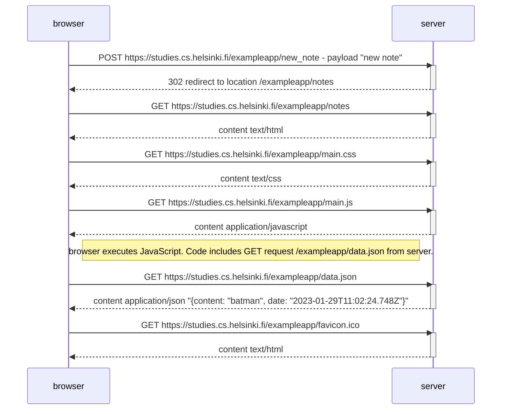

```mermaid
sequenceDiagram
    participant browser
    participant server

    browser->>server: POST https://studies.cs.helsinki.fi/exampleapp/new_note - payload "new note"
    activate server
    server-->>browser: 302 redirect to location /exampleapp/notes
    deactivate server

    browser->>server: GET https://studies.cs.helsinki.fi/exampleapp/notes
    activate server
    server-->>browser: content text/html
    deactivate server

    browser->>server: GET https://studies.cs.helsinki.fi/exampleapp/main.css
    activate server
    server-->>browser: content text/css
    deactivate server

    browser->>server: GET https://studies.cs.helsinki.fi/exampleapp/main.js
    activate server
    server-->>browser: content application/javascript
    deactivate server

    Note right of browser: browser executes JavaScript. Code includes GET request /exampleapp/data.json from server.

    browser->>server: GET https://studies.cs.helsinki.fi/exampleapp/data.json
    activate server
    server-->>browser: content application/json "{content: "batman", date: "2023-01-29T11:02:24.748Z"}"
    deactivate server

    browser->>server: GET https://studies.cs.helsinki.fi/exampleapp/favicon.ico
    activate server
    server-->>browser: content text/html
    deactivate server

```