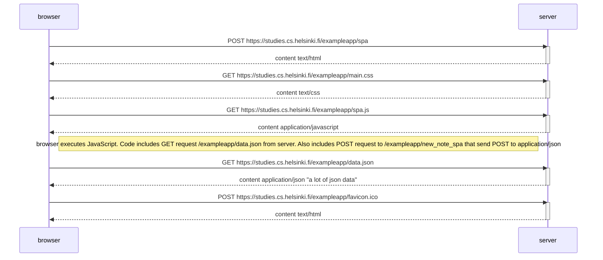

```mermaid
sequenceDiagram
    participant browser
    participant server

    browser->>server: POST https://studies.cs.helsinki.fi/exampleapp/spa
    activate server
    server-->>browser: content text/html
    deactivate server

    browser->>server: GET https://studies.cs.helsinki.fi/exampleapp/main.css
    activate server
    server-->>browser: content text/css
    deactivate server

    browser->>server: GET https://studies.cs.helsinki.fi/exampleapp/spa.js
    activate server
    server-->>browser: content application/javascript
    deactivate server

    Note right of browser: browser executes JavaScript. Code includes GET request /exampleapp/data.json from server. Also includes POST request to /exampleapp/new_note_spa that send POST to application/json

    browser->>server: GET https://studies.cs.helsinki.fi/exampleapp/data.json
    activate server
    server-->>browser: content application/json "a lot of json data"
    deactivate server

    browser->>server: POST https://studies.cs.helsinki.fi/exampleapp/favicon.ico
    activate server
    server-->>browser: content text/html
    deactivate server

```

